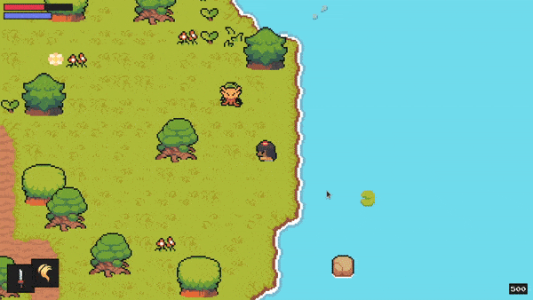
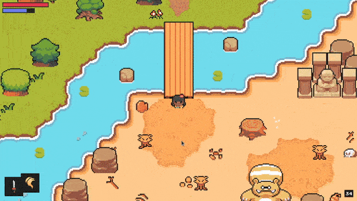
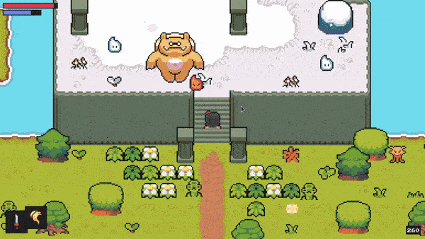
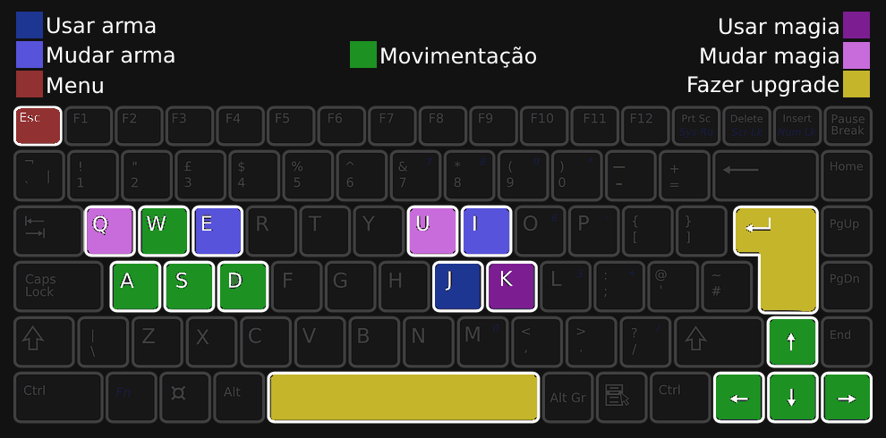

<p align="center">
  </img>
</p>

<p align="center">
  <a href="https://github.com/gcairesdev/zelda">
    </img>
  </a>
  <a href="https://github.com/gcairesdev/zelda/blob/master/LICENSE.md">
    </img>
  </a>
  <a href="https://github.com/gcairesdev/zelda">
    </img>
  </a>
</p>

# Índice

* [Sobre o projeto](#zelda)
  * [Controles](#controles)
  * [Feito com](#feito-com)
  * [Objetivo](#objetivo)
  * [Justificativa](#justificativa)
* [Iniciando](#iniciando)
  * [Pré requisitos](#pré-requisitos)
  * [Instalação](#instalação)
* [Contribuindo](#contribuindo)
* [Autor](#autor)
* [Licença](#licença)

## Zelda
> Jogo estilo Zelda feito com Python.

Uma prova de conceito de um jogo RPG estilo zelda, com combate a inimigos diferentes, algumas armas e magias, experiência, upgrade de habilidades, biomas etc.

<p align="center">
  </img>
  </img>
  </img>
</p>

## Controles

Por se tratar apenas de um POC, o jogo não tem tutorial ou menu de controles.

<p align="center">
  </img>
</p>

## Feito com
* [Python](https://www.python.org/)
* [Pygame](https://www.pygame.org/)

## Objetivo

O objetivo do projeto é aprender um pouco sobre o básico das mecanicas de um jogo.

## Justificativa

Desenvolvi esse projeto seguindo um tutorial que foi recomendado para mim no Youtube, pois achei interessante. Tutorial: https://www.youtube.com/watch?v=QU1pPzEGrqw

## Iniciando

Para iniciar, veja os pré requisitos do projeto.

## Pré requisitos
* [Python](https://python.org/downloads/)
* [Pygame](https://pygame.org/wiki/GettingStarted)

## Instalação

Clone o repositório:

```git
git clone https://github.com/gcairesdev/zelda
```

Instale o python 3 (Debian e derivados):

```sh
sudo apt install pyhton3
```

ou

Baixe pelo site:

```
https://www.python.org/downloads/
```

Instale o pygame:

```sh
python3 -m pip install -U pygame --user
```

Abra a pasta do jogo:

```sh
cd zelda
```

Rode o jogo:

```sh
python3 src/main.py
```

## Autor

|                |                  |          |            |         |
|----------------|------------------|----------|------------|---------|
| ![][githubImg] | Guilherme Caires | [Github] | [Linkedin] | [Email] |

## Contribuindo

Confira a página [CONTRIBUTING](./CONTRIBUTING.md) para ver os melhores locais para arquivar problemas, iniciar discussões e começar a contribuir.

## Licença

Lançado em 2022.
Este projeto está sob a [Licença MIT](./LICENSE.md).

---

<p align="center">
    Feito com :heart: por <a href="https://github.com/gcairesdev">Guilherme Caires</a>
</p>

<!-- Markdown link & img dfn's -->
[Github]: https://github.com/gcairesdev
[GithubImg]: https://avatars.githubusercontent.com/u/54117888?s=100
[Linkedin]: https://linkedin.com/in/guilherme-caires/
[Email]: contatogcaires@gmail.com